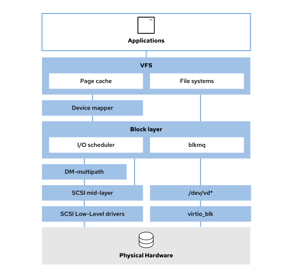

# Linux Storage



## Virtual File System (VFS)

The Virtual File System (VFS) provides supprt for standard POSIX system calls to read and write files. It implement system calls such as `open()`, `read()`, `write()`, `close()`, `stat()`, and `lseek()`.

File system implemenentations such as XFS, ext4, FAT32, and others plugin to VFS as modules and so VFS provides a common abstraction layer for the data on those file systems.

VFS maintains caches to improve performance, including an *inode cache*, *dentry cache*, *buffer cache*, and *page cache*.

`/proc/slabinfo` file records the memory usage of inode and directory caches.

```sh
# View VFS Memory Usage
cat /proc/meminfo

# Clear VFS caches
echo 3 > /proc/sys/vm/drop_caches
```

## File Systems

File systems provide the logical structures for organizing and naming metada and data in storage.

## Device Mapper

The device mapper creates mapping tables of blocks from one device layer to blocks in another logical device. Device mapper use is optional; you can directly format physical block devices with a file system without using it.

Example: an LVM logical volume named */dev/mapper/myvg-mylv1* is built from two physical volumes, */dev/vdb1* and */dev/vdb2*. When initially created with LVM utilities, the device mapper mapped the */dev/vdb1* and */dev/vdb2* physical block device partitions to the */dev/dm-0* higher logical device.

```sh
# Use the dmsetup command to view the device mapper table
dmsetup ls

ls -l /dev/mapper/myvg1-mylv1

dmsetup table /dev/mapper/myvg1-mylv1
> 0 1015808 linear 253:17 2048
> 1015808 1015808 linear 253:18 2048

# The /dev/mapper/myvg1-mylv1 volume has two mappings. The first is a 1:1 linear mapping of the block device with major:minor number 253:17 to the first 1015808 blocks of /dev/mapper/myvg1-mylv1. The second is a 1:1 linear mapping of the block device with major:minor number 253:18 to the next 1015808 blocks of /dev/mapper/myvg1-mylv1, starting at block 1015808. The major:minor numbers 253:17 and 253:18 correspond to /dev/vdb1 and /dev/vdb2:

ls -l /dev/vdb*
> brw-rw----. 1 root disk 253, 16 Sep 30 18:28 /dev/vdb
> brw-rw----. 1 root disk 253, 17 Sep 30 18:30 /dev/vdb1
> brw-rw----. 1 root disk 253, 18 Sep 30 18:30 /dev/vdb2
```

## Disk Schedulers

Disk schedulers are responsible for ordering the I/O requests that are submitted to a storage device. In RHEL8, block devices support only multi-queue scheduling. This enables block layer performance to scale with fast solid-state drives (SSDs) and multi-core CPUs.

```sh
dmesg | grep -i 'io scheduler'
```

* **none** - implements a first-in first-out (FIFO) scheduling algorithm.
* **mq-deadline** - Sorts I/O requests into a read or write batch and schedules them for executuion in increasing logical block address (LBA) order. This scheduler is especially suitable where read operations are more frequent than write operations.
* **kyber** - Tunes itself to achieve a latency goal by calculating the latencyes of every I/O request that is submitted to the block I/O layer.

* **bfq** - Ensures that a single application never uses all the bandwith. Focuses on providing low latency rather than achieving high throughput.

```sh
# to determine the current scheduler
cat /sys/block/sda/queue/scheduler
> [mq-deadline] kyber bfq none
```

## Device Mapper Multipath

Device mapper multipath (DM-Multipath) configures multiple I/O paths between servers and storage arrays so that they appear as a single device.


## The SCSI Mid-layer

The SCSI mid-layer is a bridge between the SCSI targets that present storage devices and the host bus adapters or hardware interface card drivers that communicate with the storage devices. The block device drivers are the **SCSI disk (sd)** and the **SCSI CDROM (sr)** driver. The SCSI mid-layer also provides one **SCSI driver for character-based tape devices (st)** and one for generic **SCSI devices such as scanners (sg)**.

All devices that can use or emulate the SCSI protocol can use the SCSI mid-layer. The mid-layer includes seemingly unrelated devices such as SATA devices, USB storage devices, and virtual machine disks. These devices are presented as SCSI devices and use appropriate device names, such as **/dev/sda**. Some storage devices bypass this layer. For example, the **/dev/vd*** devices are paravirtualized devices that use the **virtio_blk** driver, which does not emulate a SCSI protocol.

## Low-level Drivers

Low-level drivers communicate with physical system hardware. Examples: SCSI drivers for Qlogic(qla2xxx), local SATA(libata) or USB(ahci). Paravirtualized drivers such as *virtio_blk* interact directly with the scheduler at the block layer.
