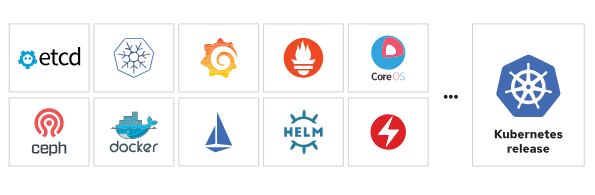

# Distributions

`Red Hat OpenShift Kubernetes Engine` (RHOKE) - includes the latest version of the Kubernetes platform with RH security hardening. It runs on RHEL Linux CoreOS.

`Red Hat OpenShift Container Platform` (RHOCP) - include developer console, as well as log management, cost management, and metering information. Additionally includes the following features: Red Hat OpenShift Severless (Knative), Red Hat OpenShift Mesh (istio), Red Hat OpenShift Pipelines (Tekton), and Red Hat OpenShift GitOps (ArgoCD).

`Red Hat OpenShift Platform Plus ()` - Red Hat Advanced Cluster Management for Kubernetes, Red Hat Advanced Cluster Security for Kubernetes, and the Red Hat Quay private registry platform.

[Link to installers](https://developers.redhat.com/products/openshift/download)

[Documentation](https://access.redhat.com/documentation/en-us/openshift_container_platform)

`OpenShift origin` (OKD) - https://www.okd.io/ 

# User types

* Regular users
Most interactive RHOCP users are represented by this user type. An RHOCP User object represents a regular user.

* System users
Infrastructure uses system users to interact with the API securely. Some system users are automatically created, including the cluster administrator, with access to everything. By default, unauthenticated requests use an anonymous system user.

* Service accounts
ServiceAccount objects represent service accounts. OCP creates service accounts automatically when a project is created. Project administrators can create additional service accounts to define access to the contents of each project.

# OpenShift key concepts
* **Pods**: The smallest unit of a Kubernetes-managed containerized application. A pod consists of one or more containers.
* **Deployments**: The operational unit that provides granular management of a running application.
* **Projects**: A Kubernetes namespace with additional annotations that provide multitenancy scoping for applications.
* **Routes**: Networking configuration to expose your applications and services to resources outside the cluster.
* **Operators** - a method of packaging, deploying, and managing a Kubernetes application. OpenShift uses this method to add capabilities to a Kubernetes cluster.
  * CVO (Cluster Version Operator)
  * OLM (Operator Lifecycle Manager)
  * RBAC (Role Based Access Control)
  * CSV (Cluster Service Version)
  * CRD (Custom Resource Definition)
